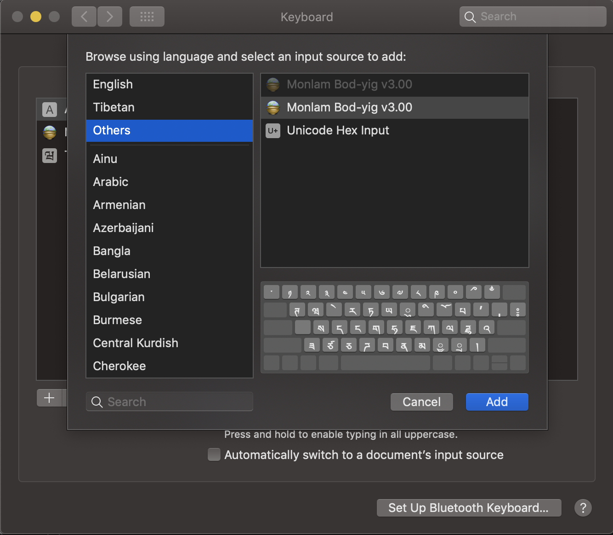

## How to install (Piece of Cake - 3 simple steps)
## སྨོན་ལམ་བོད་ཡིག་གསུམ་པ་འཇུག་སྟང་ངོ་སྤྲོད།

These steps are meant to provide transparency instead of running installers which works magically sometimes but more frustrating 
when it doesn't. Let's begin!

#### Steps

1. To copy fonts and keyboards to your computer, run the following command in your Terminal app

        curl -s https://raw.githubusercontent.com/imechemi/monlam-bodyig/master/mac/install.sh | bash

2. Go to **System Preferences** -> **Keyboard Preferences...** -> **Input Sources**

3. Then click '+' button, choose **others** and select **Monlam Bod-yig 3.00**. Then, click 'Add'

You're all set. བཀྲི་བདེ་ལེགས། 🙏🏼

**Note:** *Maintainer is serious about security, and trying to transparent to users. Also, future plan is verify the
authenticity of the each file and ensure secure installation for everyone in the community*
